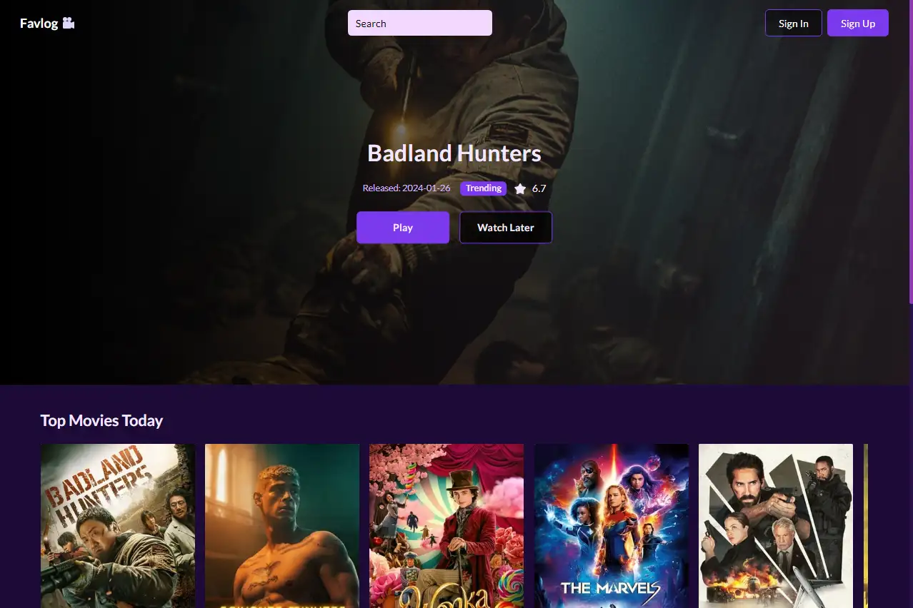

<h1 align="center">Welcome to Favlog movies 🎥</h1>
<p>
  
  <a href="https://github.com/fabrinucci/react-favlog-movies#readme" target="_blank">
    
  </a>
  <a href="https://github.com/fabrinucci/react-favlog-movies/graphs/commit-activity" target="_blank">
    
  </a>
  <a href="https://github.com/fabrinucci/react-favlog-movies/blob/main/LICENSE" target="_blank">
    
  </a>
</p>

> This is a website where you can discover the movies that are on everyone's lips, as well as those gems of cinema acclaimed by critics and audiences.
>
> - Dive into the details of each movie, from the plot, cast and critics.
> - Find out who brings each character to life.
> - Learn about the careers of actors, directors, writers and more.
> - Find the movie you are going to watch this weekend by category.
> - Search for your favorite movie just by typing its name.

### 🏠 [Homepage](https://github.com/fabrinucci/react-favlog-movies)

## Install

```sh
npm run install
```

## Usage

```sh
npm run dev
```

## Environments

```sh
API_KEY=
NEXT_PUBLIC_API_URL=https://api.themoviedb.org/3
```

## Technologies

[](https://react.dev/)
[](https://nextjs.org/)

[](https://www.typescriptlang.org/)
[](https://tailwindcss.com/)

[](https://jestjs.io/)
[](https://testing-library.com/)

## Author

👤 **Fabrizio Nucci**

[](https://fabrinucci.github.io)
[](https://github.com/fabrinucci)
[](https://linkedin.com/in/fabrinucci)
[](https://x.com/FabrizioDev)

## Show your support

Give a ⭐️ if this project helped you!

## 📝 License

Copyright © 2023 [Fabrizio Nucci](https://github.com/fabrinucci).<br />
This project is [MIT](https://github.com/fabrinucci/react-favlog-movies/blob/main/LICENSE) licensed.
